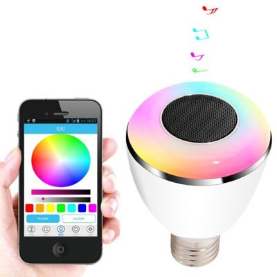

# CH Smart Bulb API

:bulb: BL08A :red_square::green_square::blue_square:  


## Usage:

Single Bulb:

```java
BulbClient bulbClient = new BlueCoveBluetoothClient();
Bulbs bulbs = new Bulbs(bulbClient);
List<BulbDevice> bulbDevices = bulbs.deviceList(); //Discovery devices
BulbDevice right = bulbs.connectDevice(bulbDevices, "RightBulb"); //Select and connect single device

right.color(Color.color().red()); //Set color red
right.commit(); //Send command to bulb

right.customEffect(new RBGRotationEffect(),FixedDelay.ms(139f)); //Custom effect

right.startCustomEffect(); //Run effect
```

Multipe Bulb:

```java
BulbClient bulbClient = new BlueCoveBluetoothClient();
Bulbs bulbs = new Bulbs(bulbClient);
List<BulbDevice> bulbDevices = bulbs.deviceList(); //Discovery devices
BulbDeviceGroup selectBulbs = bulbs.connectDevices(bulbDevices, "RightBulb", "LeftBulb"); //Select and connect group of devices

BulbDevice left = selectBulbs.getDevice("LeftBulb"); //Get specific device
BulbDevice right = selectBulbs.getDevice("RightBulb"); //Get specific device

right.color(Color.color().red()); //Set color red
right.commit(); //Send command to bulb

left.customEffect(new RBGRotationEffect(),FixedDelay.ms(139f)); //Custom effect
right.customEffect(new RBGRotationEffect(),FixedDelay.ms(139f)); //Custom effect

selectBulbs.startCustomEffect(); //Run effect in all devices
```
More examples in [MainExamples.java](src%2Fmain%2Fjava%2Fbr%2Fcom%2Frafaelbiasi%2Fchsmartbulbled%2FMainExamples.java)  

---

## Reverse engineering:

---

### Implemented:

---

#### Start/initialization:

**Data**: `30:31:32:33:34:35:36:37` (01234567)

[InitializationBulbCommand.java](src%2Fmain%2Fjava%2Fbr%2Fcom%2Frafaelbiasi%2Fchsmartbulbled%2Fcommand%2FInitializationBulbCommand.java)

---

#### Set Color/Effect:

**Data**:               `01:FE:00:00:53:83:10:00:A1:A2:A3:BB:CC:DD:EE:FF`  
**Splitted**:           `01:FE-00-00-53-83-10-00-A1-A2-A3-BB-CC-DD-EE-FF`

**Prefix**:             `01:FE`  
**Segment Type**:       `00`  
**Segment Index**:      `00`  
**Set op**:             `53`   
**Color op**:           `83`  
**Data size**:          `10` (16 bytes little-endian)  
**Data size**:          `00` (16 bytes little-endian)  
**GREEN**:              `A1`  
**BLUE**:               `A2`  
**RED**:                `A3`  
**Speed**:              `BB`  
**Effect op**:          `CC`  
**White Intensity**:    `DD`  
**Yellow Intensity**:   `EE`  
**Auto Close**:         `FF`  
[LightBulbCommand.java](src%2Fmain%2Fjava%2Fbr%2Fcom%2Frafaelbiasi%2Fchsmartbulbled%2Fcommand%2FLightBulbCommand.java)
 
##### Effect op:

**Fixed Color**:        `50` sends RGB; no speed  
**KTV**:                `51` does not send RGB; speed scale 0..30 -> high byte  
**Breathing**:          `52` sends RGB; speed 0..15 with special packaging  
**Rainbow**:            `53` does not send RGB; speed 0..15 with special packaging  
**Flash**:              `54` sends RGB; speed 0..15 with special packaging  
**Heartbeat**:          `56` sends RGB; speed 0..15 on high nibble (i << 4)  
**Automatic**:          `58` does not send RGB; speed 0..15 with special packaging  
**Candlelight**:        `5A` sends RGB; inverted speed 0..60  
**Ocean**:              `5C` does not send RGB; speed 0..15 with special packaging  
**Natural**:            `5D` does not send RGB; speed 0..15 with special packaging  
**Sunset**:             `5E` does not send RGB; speed 0..15 with special packaging  
**Passion**:            `5F` does not send RGB; speed 0..15 with special packaging  
**RGB-Cut**:            `61` does not send RGB; speed 0..15 with special packaging  

---

#### Rename:

**Data**:                   `01:FE:00:00:53:80:4C:00:00:00:00:00:00:00:00:00:03:44:65:76:69:63:65:42:54:00:00:00:00:00:00:00:00:00:00:00:00:00:00:00:00:00:00:00:00:00:00:00:00:00:00:00:00:00:00:00:00:00:00:00:00:00:00:00:00:00:00:00:00:00:00:00:00:00:00:00`  
**Splitted**:               `01:FE-00:00-53-80-4C-00-00:00:00:00:00:00:00:00-03-44:65:76:69:63:65:42:54-00:00:00:00:00:00:00:00:00:00:00:00:00:00:00:00:00:00:00:00:00:00:00:00:00:00:00:00:00:00:00:00:00:00:00:00:00:00:00:00:00:00:00:00:00:00:00:00:00:00:00`

**Prefix**:                 `01:FE`  
**Segment Type**:           `00`  
**Segment Index**:          `00`  
**Prefix op**:              `53`  
**Rename op**:              `80`  
**Data size**:              `4C` (76 bytes little-endian) 
**Data size**:              `00` (76 bytes little-endian)  
**Unknow**:                 `00:00:00:00:00:00:00:00`  
**Prefix name BT**:         `03`  
**Name**:                   `44:65:76:69:63:65:42:54` (ex: DeviceBT)  
**Remaining name empty**:   `00:00:00:00:00:00:00:00:00:00:00:00:00:00:00:00:00:00:00:00:00:00:00:00:00:00:00:00:00:00:00:00:00:00:00:00:00:00:00:00:00:00:00:00:00:00:00:00:00:00:00`

[RenameBulbCommand.java](src%2Fmain%2Fjava%2Fbr%2Fcom%2Frafaelbiasi%2Fchsmartbulbled%2Fcommand%2FRenameBulbCommand.java)

I would like to extend my sincerest gratitude to 
[**_pfalcon_**](https://github.com/pfalcon) for the project 
[**_Chsmartbulb-led-bulb-speaker_**](https://github.com/pfalcon/Chsmartbulb-led-bulb-speaker) and 
[**_samsam2310_**](https://github.com/samsam2310) for the 
[**_Bluetooth-Chsmartbulb-Python-API_**](https://github.com/samsam2310/Bluetooth-Chsmartbulb-Python-API). Both projects have been a tremendous source of
inspiration for my own work, providing valuable insights and direction. Thank you for your contributions to the
community and for inspiring fellow developers like myself.
